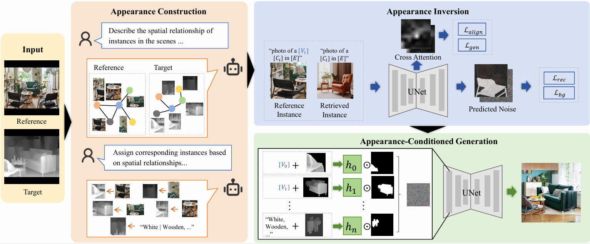

# Object-Aware-Appearance-Transfer-for-Interior-Design

# Introduction
 This repository is the official implementation of the preprint "Object-Aware Appearance Transfer for Interior Design"
 Our implemetation is based on [Diffusers](https://github.com/huggingface/diffusers), [Custom-Diffusion](https://github.com/adobe-research/custom-diffusion) and [FineControlnet](https://github.com/SamsungLabs/FineControlNet). Great thanks to the contributors!

